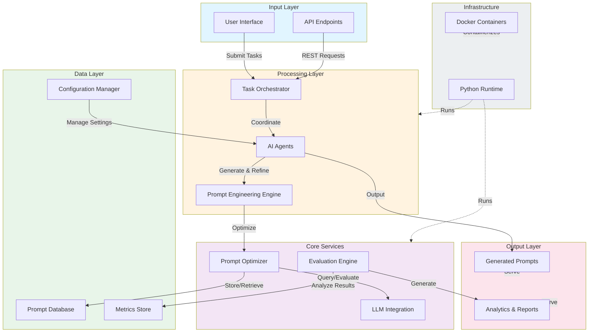

# Architecture Overview

Advanced-Prompt-Generator is an AI-powered system designed to automate prompt engineering using AI Agents.

## System Architecture

## Component Description

### Input Layer
- **User Interface**: Web or CLI interface for users to submit prompt engineering tasks
- **API Endpoints**: REST API for programmatic access and integration

### Processing Layer
- **AI Agents**: Intelligent agents that coordinate prompt generation and refinement workflows
- **Prompt Engineering Engine**: Core engine responsible for generating and iterating on prompts
- **Task Orchestrator**: Manages workflow execution and agent coordination

### Core Services
- **LLM Integration**: Manages interactions with large language models
- **Prompt Optimizer**: Optimizes prompts for better performance and efficiency
- **Evaluation Engine**: Evaluates and measures prompt effectiveness

### Data Layer
- **Prompt Database**: Stores generated prompts and their variations
- **Metrics Store**: Persists performance metrics and evaluation results
- **Configuration Manager**: Manages system and task configurations

### Output Layer
- **Generated Prompts**: Final optimized prompts ready for use
- **Analytics & Reports**: Performance reports and insights

### Infrastructure
- **Python Runtime**: Core execution environment (99.7% of codebase)
- **Docker Containers**: Containerized deployment for scalability and portability (0.3% Dockerfile)

## Technology Stack

- **Primary Language**: Python (99.7%)
- **Containerization**: Docker (0.3%)
- **Deployment**: Docker containers for isolated, reproducible environments
